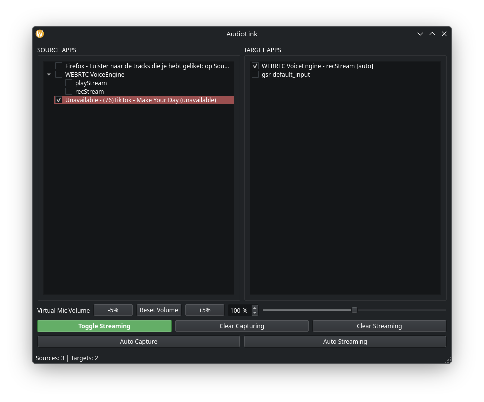

# audiolink
Linux audio router

Stream audio from app(s) to other app(s), that it.

# Requirements
- Python 3.14 (Recommended)
- UV (package manager)

# Running from source
- clone this repo and enter into the cloned folder
- run `uv sync` to install all required python packages
- run `uv run main.py` to start app

# Compile into binary
- run `uv run pyinstaller --noconfirm --clean --onefile --windowed --name audiolink main.py`
